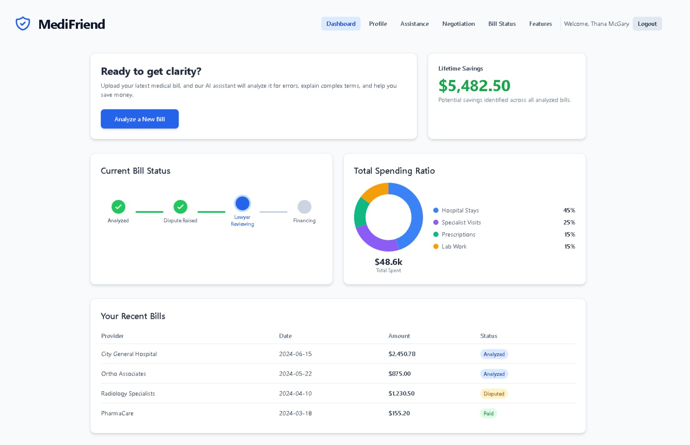
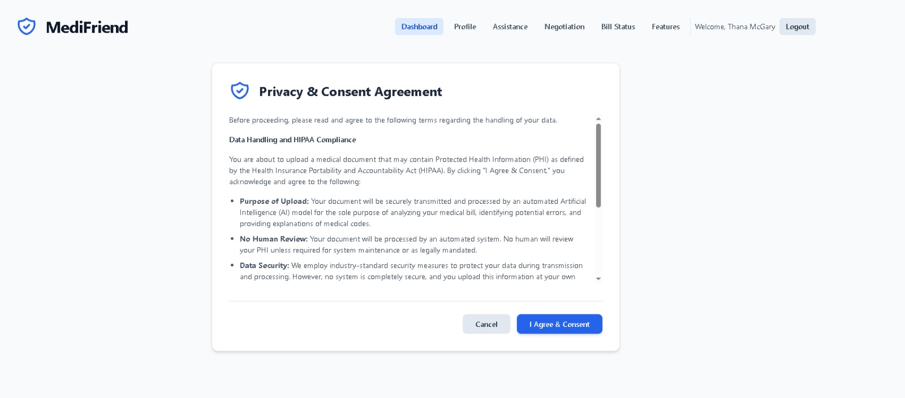
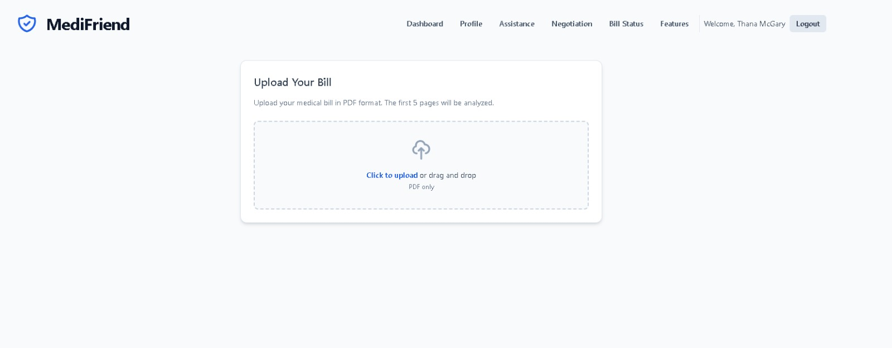
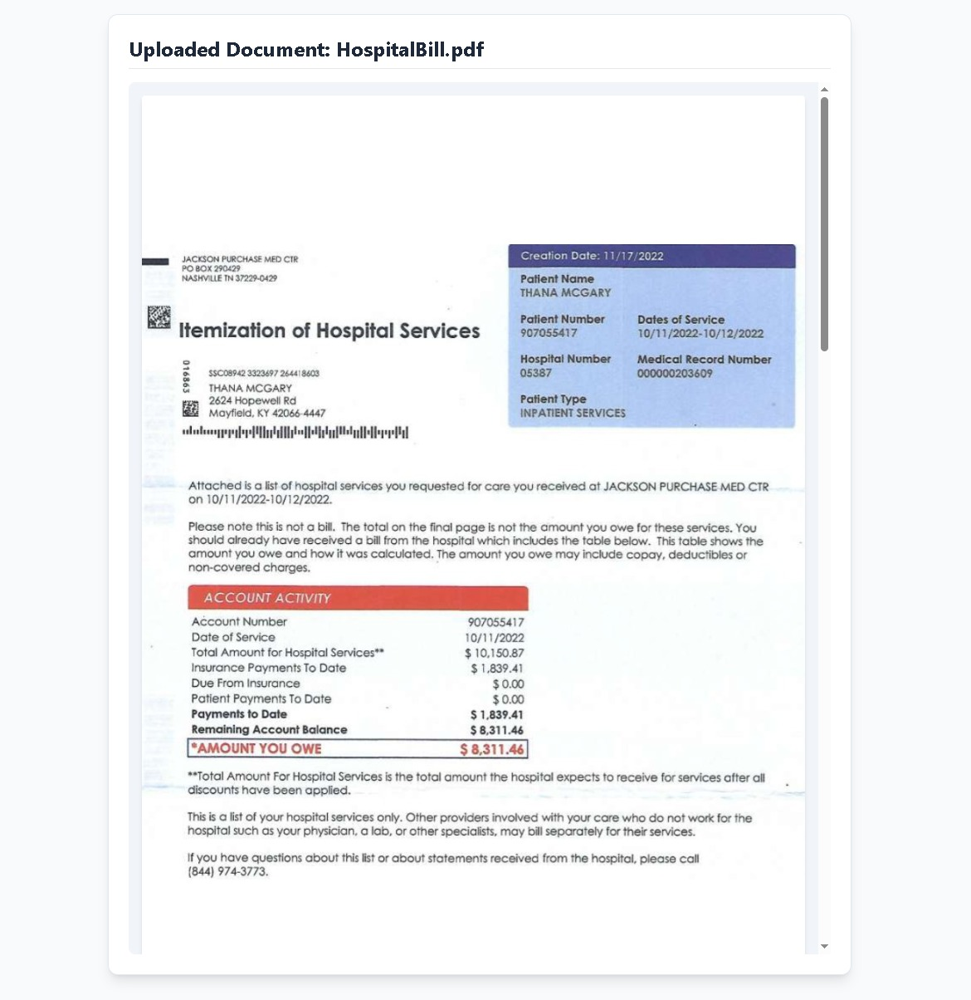
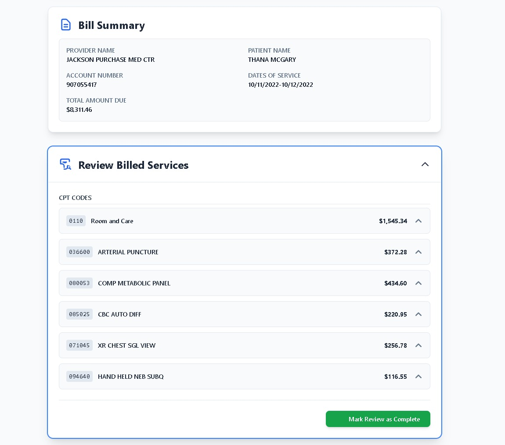
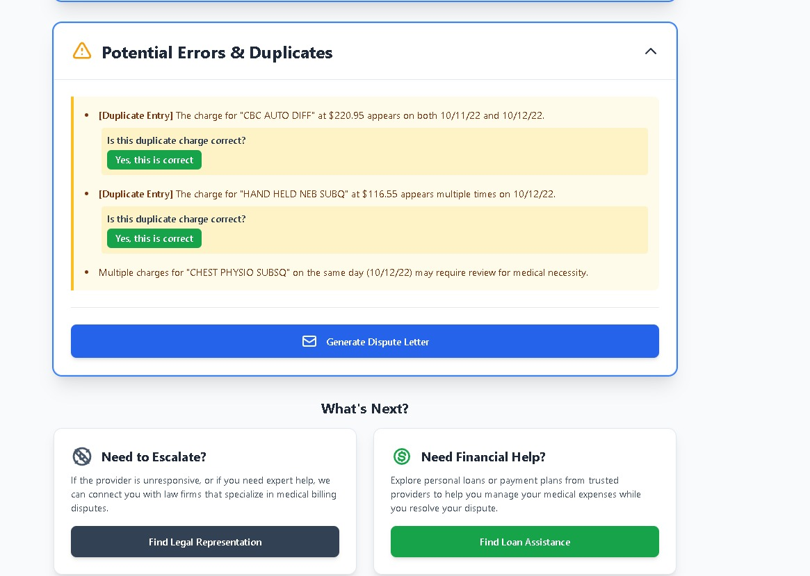
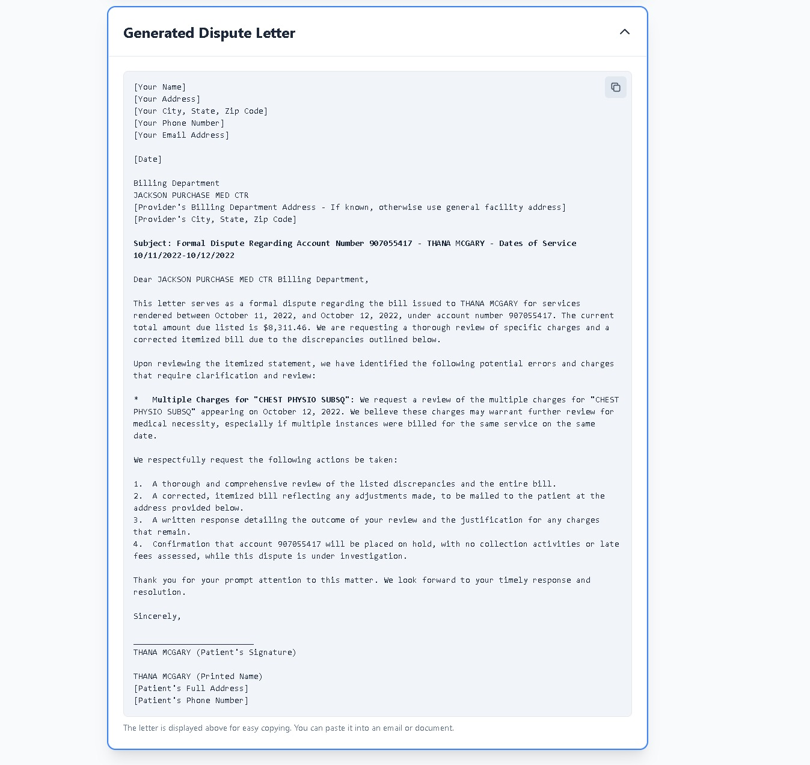

# 🏥 MediFriend — AI-Powered Medical Billing Advocate

Intelligent patient advocacy platform that demystifies medical bills through OCR, LLM analysis, and automated dispute generation.

[](https://react.dev/)
[](https://www.typescriptlang.org/)
[](https://ai.google.dev/)
[](https://vitejs.dev/)
[](https://tailwindcss.com/)

> **🏆 Winner - AI For Good Hackathon, University at Buffalo**

---

## The Problem

Over **80% of medical bills in the US contain errors** — duplicate charges, incorrect CPT codes, upcoded procedures. Patients receive complex itemized statements they can't interpret, overpay by thousands of dollars, and have no easy way to dispute charges. The system is designed to be opaque.

## The Solution

**MediFriend** acts as an AI-powered patient advocate. Upload a medical bill (PDF), and it will:

1. **Extract** every line item, CPT/ICD code, and charge using OCR
2. **Analyze** for billing errors — duplicates, upcoding, mismatched codes
3. **Generate** a legally-structured dispute letter ready to send to the provider
4. **Connect** patients with legal representation and financial assistance if needed

---

## Demo

### Dashboard
Track all your analyzed bills, spending patterns, and potential savings in one place.



### HIPAA-Compliant Upload
Privacy-first design with full HIPAA consent flow before any document is processed.





### Bill Ingestion & OCR
Upload a PDF medical bill — the system extracts and displays the original document alongside structured data.



### AI-Powered Analysis
Extracted CPT codes, service descriptions, and charges are parsed into a reviewable summary. Each line item is individually expandable.



### Error Detection
The system flags potential billing errors — duplicate entries, same-day charges, and codes that may require medical necessity review. Patients can confirm or dispute each finding.



### Automated Dispute Letter
One click generates a formal, legally-structured dispute letter referencing specific account numbers, dates of service, and flagged discrepancies — ready to send to the provider's billing department.



---

## Architecture


---

## Key Features

**AI-Driven Bill Analysis**
- OCR ingestion of PDF medical bills (up to 5 pages)
- Extracts line items, CPT/ICD codes, dates of service, and provider details
- Cross-references codes against standard billing rules to flag overcharges, duplicates, and upcoding

**Automated Advocacy**
- Generates legally-structured dispute letters with specific account numbers and discrepancy details
- Connects high-complexity cases with legal representation
- Integrated financial assistance for patients needing urgent debt relief

**Financial Intelligence**
- Spending visualization by category (hospital stays, specialist visits, prescriptions, lab work)
- Bill status tracking across the full lifecycle (Analyzed → Disputed → Resolved)
- Lifetime savings tracker across all analyzed bills

---

## Tech Stack

| Layer | Technology |
| --- | --- |
| Frontend | React 18 (TypeScript) |
| Build System | Vite |
| Styling | Tailwind CSS |
| Visualization | Recharts |
| AI / LLM | Google Gemini API |
| State Management | React Hooks |

---

## Getting Started

1. **Clone the repository**

   ```bash
   git clone https://github.com/MuditNautiyal-21/MediFriend.git
   cd MediFriend
   ```

2. **Install dependencies**

   ```bash
   npm install
   ```

3. **Set up environment variables**

   Create a `.env` file in the root directory:

   ```
   GEMINI_API_KEY=your_key_here
   ```

   > Google Gemini API offers a free tier — [get your key here](https://ai.google.dev/).

4. **Run the development server**

   ```bash
   npm run dev
   ```

5. **Open** `http://localhost:5173` in your browser

---

## Project Structure

```
MediFriend/
├── components/
│   ├── FileUpload.tsx          # PDF upload with drag-and-drop
│   ├── BillStatusChart.tsx     # Bill lifecycle status tracker
│   ├── DonutChart.tsx          # Spending breakdown visualization
│   ├── MedicalCodesDisplay.tsx # CPT/ICD code renderer
│   ├── DisputeLetter.tsx       # AI-generated dispute letter view
│   └── RepresentationConsent.tsx # Legal consent flow
├── services/
│   └── geminiService.ts        # Google Gemini API integration
├── mock/
│   └── ...                     # Demo data for presentation mode
├── App.tsx                     # Main application entry
├── types.ts                    # TypeScript type definitions
└── index.html
```

---

## My Role

Built as part of a **3-person team** at the **AI For Good Hackathon** (University at Buffalo). I was one of two developers, responsible for:

- Planning the end-to-end data flow: PDF upload → OCR → Gemini entity extraction → error detection → dispute generation
- Co-building the Gemini API integration layer (`geminiService.ts`) for structured medical data extraction
- Co-building the CPT/ICD code validation and duplicate charge detection logic
- Co-building the automated dispute letter generation pipeline

---

## Achievements

**🏆 Winner — AI For Good Hackathon, University at Buffalo**

Recognized for the innovative use of Agentic AI in solving real-world healthcare transparency issues.

---

> [!NOTE]
> This application uses mock data for demonstration purposes. The OCR and Gemini analysis pipeline is fully functional when provided with a valid API key.
